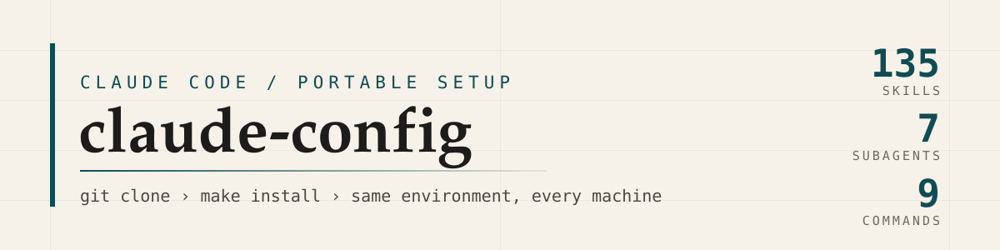
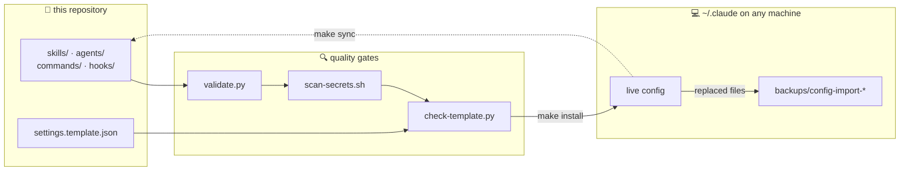

<div align="center">

<picture>
  <source media="(prefers-color-scheme: dark)" srcset="assets/banner-dark.svg">
  <source media="(prefers-color-scheme: light)" srcset="assets/banner-light.svg">
  
</picture>

<br>

[](https://github.com/satishkc7/claude-config/actions/workflows/ci.yml)
[](docs/SKILLS.md)


[](LICENSE)


**[Install](#install) · [Layout](#layout) · [Skill catalog](docs/SKILLS.md) · [Settings](#settings) · [Updating](#updating) · [CI](#ci)**

</div>

---

`~/.claude` accumulates real engineering work: skills you wrote, subagents you tuned, slash commands
that encode your workflow, hooks that shape every session. None of it is version controlled, and
none of it follows you to a new laptop or a second account.

This repository is that configuration, extracted, linted in CI, and installable in one command.

```console
$ git clone https://github.com/satishkc7/claude-config.git ~/claude-config
$ cd ~/claude-config && make install

copied  skills/    ->  ~/.claude/skills/
copied  agents/    ->  ~/.claude/agents/
copied  commands/  ->  ~/.claude/commands/
copied  hooks/     ->  ~/.claude/hooks/
wrote   ~/.claude/settings.json from template (fill in env vars)

done. restart Claude Code, then run /skills to verify.
```

<table>
<tr>
<td width="33%" valign="top">

### 📦 One clone
135 skills, 7 subagents, 9 slash commands, and 8 hooks land in `~/.claude` together. No manual
copying, no half-migrated setup.

</td>
<td width="33%" valign="top">

### 🔒 Secret-safe
Live tokens, auto-memory, and machine paths never enter the repo. A 9-pattern credential scanner
gates every commit and every CI run.

</td>
<td width="33%" valign="top">

### ✅ Verified
CI lints all 151 config files, shellchecks the scripts, and installs the whole thing into a
throwaway `CLAUDE_HOME` to prove it works.

</td>
</tr>
</table>

## How it moves



Two directions, two commands. `make install` pushes the repo into `~/.claude`. `make sync` pulls
local edits back, then lints and scans them before you commit.

## Install

```bash
make install          # copy into ~/.claude          (default, safest)
make link             # symlink ~/.claude dirs here  (edits apply immediately)
make check            # lint + catalog + template + secret scan, writes nothing
./install.sh --dry-run
```

The target directory is `$CLAUDE_HOME`, defaulting to `~/.claude`.

|  | `make install` (copy) | `make link` (symlink) |
| :--- | :--- | :--- |
| Repo and live config | independent copies | the same files |
| Edit a skill, see it live | after `make install` | immediately |
| `git status` reflects reality | after `make sync` | always |
| Claude writing into the directory | stays local | lands in the repo |
| Best for | second machine, other account | the machine you author skills on |

> [!NOTE]
> Anything replaced is copied to `~/.claude/backups/config-import-<timestamp>/` first, and an
> existing `settings.json` is never overwritten. Restart Claude Code afterwards, then confirm with
> `/skills`, `/agents`, and `/hooks`.

## Layout

```
claude-config/
├── skills/                      135 Agent Skills, one directory per skill
│   └── <name>/SKILL.md          YAML frontmatter (name + description) + instructions
├── agents/                      7 subagent definitions for the Agent tool
├── commands/                    9 slash commands (/build /plan /review /ship /spec /test ...)
├── hooks/                       SessionStart, UserPromptSubmit, Stop, and statusline scripts
├── plugins/
│   └── known_marketplaces.json  marketplaces to re-add with /plugin
├── docs/
│   └── SKILLS.md                generated catalog of every skill and what it does
├── scripts/
│   ├── validate.py              frontmatter linter (names, descriptions, dir/name match)
│   ├── scan-secrets.sh          credential scanner over tracked files
│   ├── check-template.py        asserts the settings template stays placeholder-only
│   └── gen-catalog.py           regenerates docs/SKILLS.md from skill frontmatter
├── assets/                      README banner, light and dark
├── settings.template.json       user settings, secrets and machine paths stripped
├── install.sh                   repo       ->  ~/.claude
├── sync-from-local.sh           ~/.claude  ->  repo
└── Makefile                     install | link | sync | check | catalog | stats
```

## What is inside

Full descriptions live in the generated **[skill catalog](docs/SKILLS.md)**. A sample of what the
135 skills cover:

<details>
<summary><b>Engineering workflow</b> - spec, plan, build, review, ship</summary>

`spec-driven-development` · `writing-plans` · `executing-plans` · `planning-and-task-breakdown` ·
`incremental-implementation` · `test-driven-development` · `superpowers-tdd` ·
`code-review-and-quality` · `requesting-code-review` · `receiving-code-review` ·
`verification-before-completion` · `shipping-and-launch` · `git-workflow-and-versioning` ·
`using-git-worktrees` · `finishing-a-development-branch`

</details>

<details>
<summary><b>Debugging and hardening</b> - find the cause, then close the hole</summary>

`systematic-debugging` · `debugging-and-error-recovery` · `investigate-first` ·
`doubt-driven-development` · `security-and-hardening` · `pre-deployment-checklist` ·
`performance-optimization` · `observability-and-instrumentation` · `safe-refactor` ·
`code-simplification` · `constraint-driven-development` · `surgical-patch`

</details>

<details>
<summary><b>AI and LLM engineering</b> - build the thing that calls the model</summary>

`api-integrator` · `prompt-engineer` · `eval-designer` · `rag-builder` · `mcp-builder` ·
`hallucination-checker` · `trace-analyzer` · `model-card-writer` · `infra-scaffolder` ·
`adr-writer` · `hermes-agent` · `langsmith-fetch`

</details>

<details>
<summary><b>Design and frontend</b> - interfaces, decks, and brand systems</summary>

`design-suite` · `design-system` · `ui-ux-pro-max` · `ui-styling` · `frontend-design` ·
`frontend-ui-engineering` · `design-taste-frontend` · `high-end-visual-design` · `minimalist-ui` ·
`industrial-brutalist-ui` · `theme-factory` · `banner-design` · `canvas-design` · `slides` ·
`brandkit` · `brand` · `brand-guidelines` · `imagegen-frontend-web` · `imagegen-frontend-mobile`

</details>

<details>
<summary><b>Research and writing</b> - source it, then say it clearly</summary>

`research` · `last30days` · `content-research-writer` · `technical-explainer` ·
`changelog-generator` · `documentation-and-adrs` · `domain-modeling` · `internal-comms` ·
`competitive-ads-extractor` · `twitter-algorithm-optimizer` · `meeting-insights-analyzer`

</details>

<details>
<summary><b>Context and token economy</b> - keep long sessions cheap and sharp</summary>

`caveman` and its 11 companions (`caveman-commit`, `caveman-review`, `caveman-explore`,
`caveman-stats`, ...) · `cavecrew` with three compressed subagents · `context-engineering` ·
`compress` · `claude-mem` · `graphify` · `dispatching-parallel-agents` ·
`subagent-driven-development`

</details>

## Settings

`settings.template.json` carries the hook wiring, statusline, model, and effort level. Two fields
are blanked on purpose, and CI fails if either is ever filled in.

| Field | Why it is blank | What to do on a new machine |
| :--- | :--- | :--- |
| `env.NOTION_API_KEY` | real key, must not be committed | export it in your shell, or set it in `~/.claude/settings.json` |
| `permissions.additionalDirectories` | machine-specific paths | add your own project paths locally |

> [!IMPORTANT]
> Two hook entries call `~/.claude-mem/capture.sh` and `~/.claude-mem/summarize.sh`. Install
> [claude-mem](https://github.com/thedotmack/claude-mem), or delete those entries from
> `settings.json`, or every session start logs a missing-file error.

## Excluded by design

`.gitignore` blocks the parts of `~/.claude` that are either secret or worthless on another machine.

| Excluded | Reason |
| :--- | :--- |
| `settings.local.json` | permission rules with live access tokens embedded in them |
| `projects/` | per-project state, including auto-memory files and their credentials |
| `history.jsonl`, `sessions/`, `session-env/`, `shell-snapshots/` | session state, machine-specific |
| `telemetry/`, `paste-cache/`, `file-history/`, `cache/`, `backups/` | transient data |

> [!WARNING]
> Auto-memory in `~/.claude/projects/<slug>/memory/` holds personal notes and credentials. If you
> want it on more than one machine, sync it through a separate **private** repository, never this one.

## Updating

```bash
make sync                                          # ~/.claude -> repo, then lint + scan
make catalog                                       # refresh docs/SKILLS.md
git add -A && git commit -m "add x skill" && git push
```

On every other machine: `git pull && make install`. Nothing to do if you installed with `make link`.

> [!TIP]
> Run `make check` before pushing. It is the same set of gates CI runs, so a green local check means
> a green pipeline.

## CI

[`.github/workflows/ci.yml`](.github/workflows/ci.yml) runs on every push and pull request.

| Gate | What it proves |
| :--- | :--- |
| `scripts/validate.py` | every skill has a `SKILL.md` whose frontmatter `name` matches its directory and carries a description; same for agents and commands |
| `scripts/scan-secrets.sh` | no Anthropic, GitHub, AWS, Slack, Google, Notion, or private-key pattern in any tracked file |
| `scripts/check-template.py` | `settings.template.json` parses and still holds only placeholders |
| `shellcheck -S warning` | installer, sync script, and scanner are clean; vendored hooks are advisory |
| `scripts/gen-catalog.py --check` | `docs/SKILLS.md` matches the skills actually in the tree |
| installer smoke test | `install.sh` runs against a throwaway `CLAUDE_HOME` and the expected files exist |

<details>
<summary>Run the same gates locally</summary>

```console
$ make check
checked  135 skills
checked    7 agents
checked    9 commands

all frontmatter valid
docs/SKILLS.md is up to date
settings.template.json is valid JSON with placeholders intact
scanned 791 tracked files - no credential patterns found
```

</details>

## Requirements

`bash` 3.2+ · `git` · `rsync` · `python3` 3.9+. Nothing else, no package installs.

## License

MIT, see [LICENSE](LICENSE). Third-party skills retain whatever license their author assigned.

<div align="center">
<br>
<sub>Built for Claude Code. <a href="https://docs.claude.com/en/docs/claude-code">Docs</a> · <a href="docs/SKILLS.md">Skill catalog</a> · <a href="https://github.com/satishkc7/claude-config/issues">Issues</a></sub>
</div>
